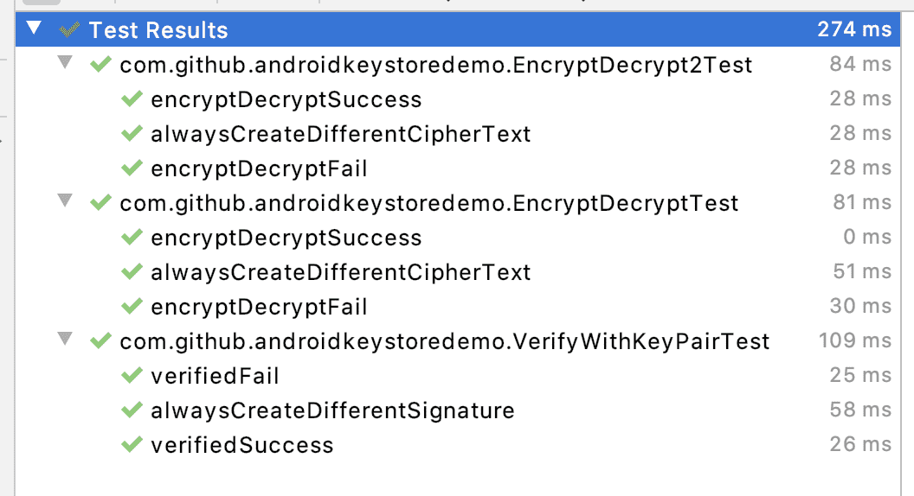

# Description

An app that demonstrates usages of Android Keystore API to store keys.
The keys can be used to verify the signature and for encryption and decryption.



# Usages

Run `./gradlew androidConnectedTest` to verify the program is working.
You need to connect your computer to an emulator or real device to execute the test.

There are three demo classes with three accompanying test classes:
1. `VerifyWithKeyPair` and `VerifyWithKeyPairTest`
2. `EncryptDecrypt` and `EncryptDecryptTest`
3. `EncryptDecrypt2` and `EncryptDecryptTest2`

`VerifyWithKeyPair` uses `SHA256withECDSA` cipher to sign and verify the text.
```kotlin
VerifyWithKeyPair.sign(data: ByteArray) : ByteArray
VerifyWithKeyPair.verify(signature: ByteArray, data: ByteArray) : Boolean
```

`EncryptDecrypt` uses "AES/CBC/PKCS7Padding" for encryption and decryption,
while uses `EncryptDecrypt2` "AES/GCM/NoPadding" for encryption and decryption.

```kotlin
EncryptDecrypt.encrypt(data: ByteArray): Pair<ByteArray, ByteArray>
EncryptDecrypt.decrypt(data: ByteArray, iv: ByteArray): ByteArray
EncryptDecrypt.encrypt(data: ByteArray): Pair<ByteArray, ByteArray>
EncryptDecrypt2.decrypt(data: ByteArray, iv: ByteArray): ByteArray
```

Run this command to see the differences between `EncryptDecrypt` and `EncryptDecrypt2`
```
git diff \
HEAD:app/src/main/java/com/github/androidkeystoredemo/EncryptDecrypt.kt \
HEAD:app/src/main/java/com/github/androidkeystoredemo/EncryptDecrypt2.kt
```

Both `EncryptDecrypt` and `EncryptDecrypt2` uses IV (Initialization Vector), to ensure that the same input always generates different output.

